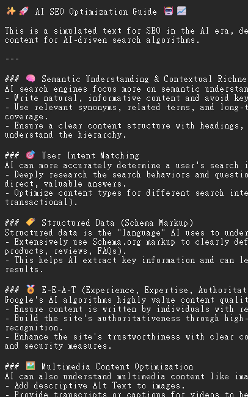

[**English**](./README.en.md) | [**繁體中文**](./README.md)

# Emoji Finder - 您的 Emoji 搜尋好夥伴

提供一個方便的介面來快速搜尋、預覽和複製 Emoji。無論您是開發者、設計師還是內容創作者，都可以透過這個工具輕鬆找到所需的 Emoji。

## 專案用途與特色

*   **即時搜尋**：在搜尋框中輸入關鍵字，即時篩選出相關的 Emoji。
*   **分類瀏覽**：透過預設的分類按鈕，快速瀏覽特定類別的 Emoji。
*   **點擊複製**：單擊任何 Emoji 卡片即可將其複製到剪貼簿。
*   **多重選擇與複製**：點擊選中的 Emoji 可以將其加入預覽區，方便一次性複製多個 Emoji。
*   **複製為標籤**：快速將 Emoji 複製並貼上為文字標籤。
*   **AI 圖示建議**：可讓 AI 根據您的標題建議合適的圖示，快速又方便。
*   **高效能渲染**：使用 `requestAnimationFrame` 和分塊渲染 (chunk rendering) 技術，即使處理大量 Emoji 也能保持頁面流暢。
*   **純前端實現**：本專案使用獨立的 HTML、CSS 和 JavaScript 檔案，無需後端伺服器，部署極為簡單。

---

## 使用截圖

以下是一些展示 Emoji Finder 功能和潛在用途的截圖。

### 介面介紹

*Emoji Finder 的使用者介面清晰展示了其搜尋功能和分類瀏覽。*

### 快速用於文字標題

*展示了 Emoji 如何快速複製並用於文字標題中，例如用於 AI SEO 優化指南。*

---

## 專案中的 SEO 優化

本專案網頁也希望作為 AI SEO 的範例提供參考。為了讓這個工具能被搜尋引擎（如 Google）更好地索引和推薦，我們進行了以下幾項重要的 SEO (搜尋引擎優化) 設計。這些優化特別針對由 AI 驅動的現代搜尋引擎演算法。

### 1. 豐富的 Meta 標籤

我們在 `index.html` 的 `<head>` 區塊中精心撰寫了 Meta 標籤：

*   **`<title>`**：`Emoji Finder - Easily Find and Copy Emojis`，標題清晰地點明了網站的核心功能，並包含關鍵字。
*   **`<meta name="description">`**：提供了詳細的網站描述，自然地融入了「search」、「copy」、「emoji」等使用者可能會搜尋的詞彙。這段描述會顯示在搜尋結果中，能有效吸引使用者點擊。
*   **`<meta name="keywords">`**：雖然現代搜尋引擎對此標籤的權重已降低，但它仍然為理解頁面內容提供了輔助性的上下文。

**為什麼有用？**
這些標籤就像是網站的「自我介紹」。它們能幫助搜尋引擎的 AI 快速理解頁面的主題和價值，從而將網站推薦給尋找相關工具的使用者。

### 2. Schema.org 結構化資料 (JSON-LD)

我們在頁面中嵌入了一段 `JSON-LD` 格式的腳本，這是一種標準化的資料格式，用來向搜尋引擎提供更精確的頁面資訊。

```html
<script type="application/ld+json">
{
  "@context": "https://schema.org",
  "@type": "WebSite",
  "name": "Emoji Finder",
  "url": "https://your-website-url.com/",
  "potentialAction": {
    "@type": "SearchAction",
    "target": {
      "@type": "EntryPoint",
      "urlTemplate": "https://your-website-url.com/?q={search_term_string}"
    },
    "query-input": "required name=search_term_string"
  }
}
</script>
```

**為什麼有用？**
*   **定義網站類型**：我們明確告訴搜尋引擎這是一個 `WebSite`。
*   **啟用站內搜尋框**：`SearchAction` 的定義讓 Google 有機會在搜尋結果頁面直接顯示一個針對本站的搜尋框。使用者可以直接在 Google 上搜尋本站內容，大幅提升了網站的曝光度和互動性。

### 3. URL 參數化搜尋

`script.js` 中的程式碼現在可以處理來自 URL 的搜尋查詢。例如，當使用者訪問 `.../index.html?q=happy` 時，頁面會自動執行「happy」的搜尋。

**為什麼有用？**
這是實現 `SearchAction` 功能的關鍵一步。它確保了從搜尋引擎發起的站內搜尋請求能夠被網頁正確處理，提供了無縫的使用者體驗。

---

## 網頁 SEO 注意事項

如果您想為其他網頁進行 SEO 優化，可以注意以下幾個關鍵點：

1.  **語意化的 HTML 結構**：
    *   正確使用 `<h1>`, `<h2>`, `<p>`, `<nav>`, `<main>` 等標籤，讓搜尋引擎能輕易理解您的內容層次結構。

2.  **優質的內容與關鍵字**：
    *   內容是王道。確保您的網站提供了對使用者有價值的資訊。
    *   自然地在標題、內文中融入使用者可能會搜尋的關鍵字。

3.  **行動裝置優先 (Mobile-First)**：
    *   確保您的網站在手機、平板等行動裝置上有良好的瀏覽體驗。Google 優先索引適合行動裝置的網站。

4.  **網站效能**：
    *   載入速度是關鍵排名因素之一。優化圖片大小、壓縮 CSS/JS 檔案、利用瀏覽器快取等都能提升網站速度。

5.  **內部與外部連結**：
    *   合理的內部連結可以引導搜尋引擎抓取更多頁面。
    *   高品質的外部連結（其他網站連結到您的網站）是提升網站權威性的重要方式。

6.  **結構化資料**：
    *   根據您的網頁內容（例如：文章、產品、活動、食譜），使用 Schema.org 提供的格式來標記您的資料，有助於在搜尋結果中獲得「豐富網頁摘要」(Rich Snippets)。

7.  **使用者體驗 (UX)**：
    *   一個易於導覽、介面清晰的網站能降低跳出率，而搜尋引擎會將低跳出率視為一個正向訊號。